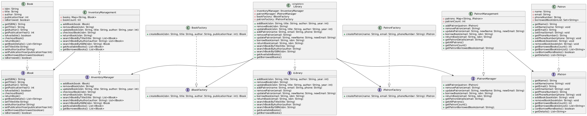

# Library Management System

## Overview
This project is a Java-based Library Management System designed to handle essential library operations such as managing books, patrons, borrowing, and returning books. It is built with modular design principles using interfaces, factories, and the singleton pattern for scalability and maintainability.

## Features

* Add, remove, and update books and patrons

* Borrow and return books with borrowing limits enforced

* Search for books by title, author, or ISBN

* View lists of available and borrowed books

* Uses design patterns such as Factory and Singleton to manage object creation and system-wide state

* Logging support for tracking operations and errors

## Architecture & Design

The system is divided into multiple layers and modules for separation of concerns:

* **Controller Layer:** Provides the `Library` singleton class which acts as the main interface for the application.

* **Management Layer:** Includes `InventoryManagement` and `PatronManagement` classes that manage books and patrons respectively, implementing corresponding interfaces.

* **Model Layer:** Defines `Book` and `Patron` entities with their interfaces.

* **Factory Layer:** Provides factory interfaces and implementations to create instances of `Book` and `Patron`.

* **Utils:** Utility classes for logging and constants.

## Getting Started

### Prerequisites

* Java Development Kit (JDK) 11 or higher

* Your favorite Java IDE or command-line tools

### Running the Application

1. Clone the repository:

git clone https://github.com/yourusername/library-management-system.git

2. Navigate to the project directory.

3. Compile the source code:

javac -d bin $(find src -name "*.java")

4. Run the main program:

java -cp bin Main

## Usage

The system supports the following operations through the `Library` class:

* Adding, removing, and updating books and patrons

* Borrowing and returning books

* Searching books by title, author, or ISBN

* Listing all available or borrowed books

Example usage can be found in the `Main.java` file.

## Design Patterns Used

* **Singleton:** Ensures a single instance of the `Library` controller.

* **Factory:** Used for creating `Book` and `Patron` objects in a modular and extensible way.

* **Interfaces:** Abstracts the implementation details and promotes loose coupling.

## Class Diagram

Please refer to the `docs/ClassDiagram.png` file for the full class diagram depicting relationships between classes and interfaces.

## Contributing

Contributions, issues, and feature requests are welcome! Feel free to check the [issues page](https://github.com/yourusername/library-management-system/issues).

## License

This project is licensed under the MIT License. See the [LICENSE](LICENSE) file for details.

## Author

Muhammed Hilal

hilalsidhic21@gmail.com

[GitHub Profile](https://github.com/hilalsidhic)